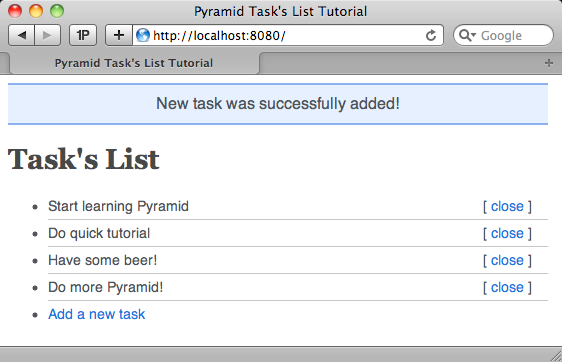

Pyramid Quick Tutorial
======================

This tutorial is intended to provide you with a feel of how a Pyramid web
application is created. The tutorial is very short, and focuses on the
creation of a minimal application using common idioms.  For brevity, the
tutorial uses a "single-file" application development approach instead of the
more complex (but more common) "scaffolds" described in the main Pyramid
documentation.

At the end of the tutorial, you'll have a minimal application which:

- provides views to insert and close tasks

- uses route patterns to match your URLs to view code functions

- uses Mako Templates to render your views

- stores data in an SQLite database

Step 1 - Organizing The Project
-------------------------------

Before getting started, we need to create a directory hierarchy needed for
our application layout. The ``tasks`` directory will not be used as a python
package, it'll just serve as a container in which we can put our project
files.  Create the follow directory layout on your filesystem:

.. code-block:: text

    /tasks
        /static
        /templates

Step 2 - Application Setup
--------------------------

To begin our application, start by adding a Python source file named
``tasks.py`` to the ``tasks`` directory.  We'll add a few basic imports
within the newly created file:

.. code-block:: python

    import os
    import logging
    
    from pyramid.config import Configurator
       
    from paste.httpserver import serve

Then we'll set up logging and current working directory path:

.. code-block:: python
    
    logging.basicConfig()
    log = logging.getLogger(__file__)
    
    here = os.path.dirname(os.path.abspath(__file__))

Finally, in a block that runs only when the file is executed, we'll configure
the Pyramid application, obtain the WSGI app and serve it.

.. code-block:: python
    
    if __name__ == '__main__':
        # configuration settings
        settings = {}
        settings['reload_all'] = True
        settings['debug_all'] = True
        # configuration setup
        config = Configurator(settings=settings)
        # serve app
        app = config.make_wsgi_app()
        serve(app, host='0.0.0.0')

We now have the basic application layout needed to run our application, but
we still need to add database support, routing, views and templates.

Step 3 - Database And Schema
----------------------------

To make things straightforward, we'll use the widely installed SQLite
database for our project. The schema for our tasks is also simple: an **id**
to uniquely identify the task, a **name** not longer than 100 characters and
a **closed** boolean to indicate if the task is closed or not.

Add to the ``tasks`` directory a file named ``schema.sql`` with the following
content:

.. code-block:: sql

    CREATE TABLE IF NOT EXISTS tasks (
        id INTEGER PRIMARY KEY AUTOINCREMENT,
        name CHAR(100) NOT NULL,
        closed BOOL NOT NULL
    );
    
    INSERT OR IGNORE INTO tasks (id, name, closed) VALUES (1, 'Start learning Pyramid', 0);
    INSERT OR IGNORE INTO tasks (id, name, closed) VALUES (2, 'Do quick tutorial', 0);
    INSERT OR IGNORE INTO tasks (id, name, closed) VALUES (3, 'Have some beer!', 0);

We'll also need to add a few more imports to the ``tasks.py`` file:

.. code-block:: python

    ...
    from pyramid.events import NewRequest
    from pyramid.events import subscriber
    from pyramid.events import ApplicationCreated
    ...
    from paste.httpserver import serve
    import sqlite3
    ...

To make the process of creating the database slightly easier, rather than
requiring a user to execute the data import manually with SQLite, we'll
subscribe a function to a Pyramid system event for this purpose. By
subscribing a function to the ``ApplicationCreated`` event, each time we'll
start the application, our subscribed function will be executed.
Consequently, our database will be created or updated as necessary when the
application is started.

.. code-block:: python
    
    @subscriber(ApplicationCreated)
    def application_created_subscriber(event):
        log.warn('Initializing database...')
        f = open(os.path.join(here, 'schema.sql'), 'r')
        stmt = f.read()
        settings = event.app.registry.settings
        db = sqlite3.connect(settings['db'])
        db.executescript(stmt)
        db.commit()
        f.close()

We also need to make our database connection available to the application.
We'll provide the connection object as an attribute of the application's
request. By subscribing to the Pyramid ``NewRequest`` event we'll initialize
a connection to the database when a Pyramid request begins.  It will be
available as ``request.db``.  We'll arrange to close it down by the end of
the request lifecycle using the ``request.add_finished_callback`` method.

.. code-block:: python

    @subscriber(NewRequest)
    def new_request_subscriber(event):
        request = event.request
        settings = request.registry.settings
        request.db = sqlite3.connect(settings['db'])
        request.add_finished_callback(close_db_connection)

    def close_db_connection(request):
        request.db.close()

To make those changes active, we'll have to specify the database location in
the configuration settings and to make sure our ``@subscriber`` decorator is
scanned by the application at runtime.

.. code-block:: python

    if __name__ == '__main__':
        ...
        settings['db'] = os.path.join(here, 'tasks.db')
        ...
        config.scan()
        ...

We now have the basic mechanism in place to create and talk to the database 
in the application through ``request.db``.

Step 4 - Views Functions And Routes
-----------------------------------

It's now time to expose some functionality to the world in the form of view
functions. We'll start by adding a few imports to our ``tasks.py`` file.  In
particular, we're going to import the ``view_config`` decorator, which will
let the application discover and register views.

.. code-block:: python

    ...
    from pyramid.exceptions import NotFound
    from pyramid.httpexceptions import HTTPFound
    from pyramid.session import UnencryptedCookieSessionFactoryConfig
    from pyramid.view import view_config
    ...

We'll now add some view functions to our application for listing, adding and
closing todos. 

List View
+++++++++

This view is intended to show all open entries, according to our schema, from
the database. It uses the ``list.mako`` template available under the
``templates`` directory by defining it as the ``renderer`` in the
``view_config`` decorator. The results returned by the query are tuples but
we convert them into a dictionary for easier accessibility within the
template.  The view function will pass a dictionary defining ``tasks`` to the
``list.mako`` template.

.. code-block:: python

    @view_config(route_name='list', renderer='list.mako')
    def list_view(request):
        rs = request.db.execute("select id, name from tasks where closed = 0")
        tasks = [dict(id=row[0], name=row[1]) for row in rs.fetchall()]
        return {'tasks': tasks}

When using the ``view_config`` decorator, it's important to specify a
``route_name`` to match a defined route and a ``renderer`` if the function is
intended to render a template. The view function should then return a
dictionary expected by the renderer to access variables.  Our ``list_view``
above does both.

New View
++++++++

This view lets the user add new tasks to the application. If a ``name`` is
provided to the form, a task is added to the database, an information message
is flashed to be displayed on the next request and the requesting user's
browser is redirected back to the *list_view*. If nothing is provided, a
warning message is flashed and the *new_view* is displayed again.

.. code-block:: python

    @view_config(route_name='new', renderer='new.mako')
    def new_view(request):
        if request.method == 'POST':
            if request.POST.get('name'):
                request.db.execute('insert into tasks (name, closed) values (?, ?)',
                                   [request.POST['name'], 0])
                request.db.commit()
                request.session.flash('New task was successfully added!')
                return HTTPFound(location=request.route_url('list'))
            else:
                request.session.flash('Please enter a name for the task!')
        return {}

.. warning::

    Be sure to use question marks when building SQL statements via
    ``db.execute``, otherwise your application will be vulnerable to SQL
    injection when using string formatting.

Close View
++++++++++

This view lets the user mark a task as closed, flahes a success message and
redirects back to the *list_view* page.

.. code-block:: python

    @view_config(route_name='close')
    def close_view(request):
        task_id = int(request.matchdict['id'])
        request.db.execute("update tasks set closed = ? where id = ?", (1, task_id))
        request.db.commit()
        request.session.flash('Task was successfully closed!')
        return HTTPFound(location=request.route_url('list'))

NotFound View
+++++++++++++

This view lets us customize the default ``NotFound`` view provided by
Pyramid, which is displayed by Pyramid when a URL cannot be mapped to a
Pyramid view, by using our own template.  We'll add the template in a
subsequent step.

.. code-block:: python

    @view_config(context='pyramid.exceptions.NotFound',
                 renderer='notfound.mako')
    def notfound_view(self):
        return {}

Adding Routes
+++++++++++++

We finally need to add some routing elements to our application configuration
if we want our view functions to be matched to application URLs.

.. code-block:: python

    ...
    # routes setup
    config.add_route('list', '/')
    config.add_route('new', '/new')
    config.add_route('close', '/close/{id}')
    ...

We've now added functionality to the application by defining views exposed
through the routes system.

Step 5 - View Templates
-----------------------

Next step is to provide the application something to render what a web
browser understands: **HTML**.  To ease HTML development, we'll use one of
the default templating engines supported out of the box by Pyramid; *Mako
Templates*.

We'll also use Mako template inheritance.  Template inheritance makes it
possible to reuse a generic layout across multiple templates, easing layout
maintenance and uniformity.

Create the following templates in the ``templates`` directory with the
respective content:

layout.mako
+++++++++++

This template contains the basic layout structure that will be shared with
other templates. Inside the body tag we've defined a block to display flash
messages sent by the application and another block to display the content of
the page inheriting this master layout by using the mako directive
``${next.body()}``.

.. literalinclude:: pyramid_quick_tutorial/templates/layout.mako
   :language: html+mako

list.mako
+++++++++

This template is used by the ``list_view`` view function.  This template
extends the master ``layout.mako`` template by providing a listing of
tasks. The loop uses the passed ``tasks`` dictionary sent from the
``list_view`` function using Mako syntax. We also use the
``request.route_url`` function to generate a url based on a route name and
its arguments instead of statically defining the url path.

.. literalinclude:: pyramid_quick_tutorial/templates/list.mako
   :language: html+mako

new.mako
++++++++

This template is used by the ``new_view`` view function.  The template
extends the master ``layout.mako`` template by providing a basic form to add
new tasks.

.. literalinclude:: pyramid_quick_tutorial/templates/new.mako
   :language: html+mako

notfound.mako
+++++++++++++

This template extends the master ``layout.mako`` template.  We use it as the
template for our custom ``NotFound`` view.

.. literalinclude:: pyramid_quick_tutorial/templates/notfound.mako
   :language: html+mako

Configuring Template Locations
++++++++++++++++++++++++++++++

To make it possible for views to find the templates they need by renderer
name, we now need to specify where the Mako templates can be found by
modifying the application configuration settings.

.. code-block:: python

    ...
    settings['mako.directories'] = os.path.join(here, 'templates')
    ...

Step 6 - Styling Your Templates
-------------------------------

It's now time to add some styling to the application templates by adding a
**CSS** file named ``style.css`` to the ``static`` directory with the
following content:

.. literalinclude:: pyramid_quick_tutorial/static/style.css
   :language: css

To cause this static file to be served by the application, we must add a
"static view" directive to the application configuration:

.. code-block:: python

    ...
    config.add_static_view('static', os.path.join(here, 'static'))
    ...

Step 7 - Running The Application
--------------------------------

We have now completed all steps needed to run the application in its final
version. Before running it, here's the complete main code for ``task.py`` for
review:

.. literalinclude:: pyramid_quick_tutorial/tasks.py
   :language: python

And now let's run ``tasks.py``:

.. code-block:: bash

    $ python tasks.py 
    WARNING:tasks.py:Initializing database...
    serving on 0.0.0.0:8080 view at http://127.0.0.1:8080

Conclusion
----------

This introduction to Pyramid was inspired by **flask** and **bottle** 
tutorials with the same minimalistic approach in mind. Big thanks Chris 
McDonough, Carlos De La Guardia and Casey Duncan for their support and 
friendship.
